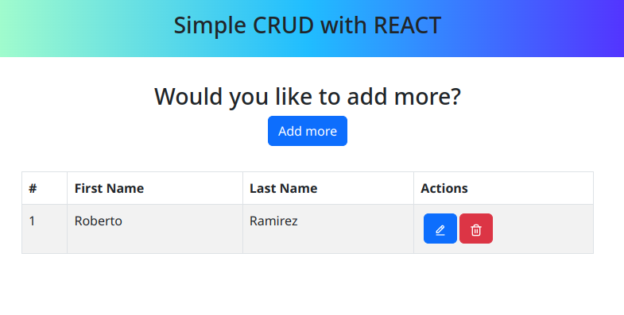

# Basic CRUD



It's about CRUD, for those who dont't know CRUD is the composition of the first letter of 4 basic functions of a system that works with a database.

C = Create
R = Read
U = Update
D = Delete
## How to run the project?

1. Clone the repo
2. Install dependencies
```
npm install
// or
yarn
```
3. Run the project
```
npm start
```

## Ingredients

- ReactJS
- React Bootstrap
- Redux

## Project Structure

```
$PROJECT_ROOT
└── cypress
└── src
    ├── components          # UI components
    ├── pages               # Pages of the project
    ├── utils               # Redux config + data
    └── App.vue             # Root component
    └── main.ts             # Entry point
```